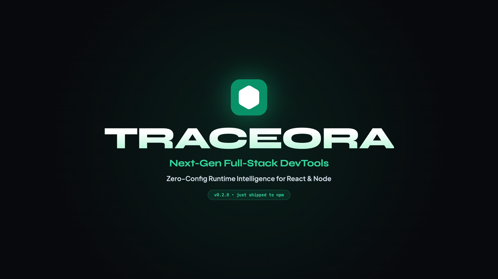

<div align="center">
  <br/>
  
  <h1>Traceora</h1>
  <p><strong>Next-Generation Runtime Intelligence & Telemetry for Modern Applications</strong></p>

  <p>
    <a href="https://traceora-web.vercel.app/"><strong>Website</strong></a>&ensp;·&ensp;
    <a href="./docs/README.md"><strong>Docs</strong></a>&ensp;·&ensp;
    <a href="https://www.npmjs.com/package/@traceora/core"><strong>NPM</strong></a>&ensp;·&ensp;
    <a href="https://github.com/zuhaib-dev/traceora/issues"><strong>Issues</strong></a>&ensp;·&ensp;
    <a href="./CONTRIBUTING.md"><strong>Contributing</strong></a>
  </p>

  <p>
    <a href="https://www.npmjs.com/package/@traceora/core"></a>&ensp;
    <a href="https://www.npmjs.com/package/@traceora/react"></a>&ensp;
    <a href="https://www.npmjs.com/package/@traceora/next"></a>&ensp;
    <a href="https://github.com/zuhaib-dev/traceora/blob/main/LICENSE"></a>
  </p>
  <br/>
</div>

<p align="center">
  <a href="./traceora-showcase.mp4">
    
  </a>
</p>

> **See what your app is doing.** Traceora records browser and backend events in a bounded local timeline. Pass a trace handle to `trace.fetch()` when you want an interaction and its request to share a trace ID.

---

## ✨ Features

|  | Feature | Description |
|---|---|---|
| 🪄 | **One-Click IDE Jump** | Open the exact file & line of an error in VSCode / Cursor directly from the DevTools overlay. |
| 🛑 | **Live Network Mocking** | Click "Mock Request" on any API call to intercept it. Force 500 errors or fake JSON — zero code. |
| 🔗 | **Trace propagation** | A trace handle can carry its ID through `trace.fetch()` into an instrumented backend request. |
| ⚡ | **Component instrumentation** | The Vite plugin instruments named function components written as declarations or block-bodied functions. |
| 🌐 | **Browser diagnostics** | Capture network timing, errors, route changes, and component lifecycle events in the local DevTools. |

---

## 📦 Ecosystem

| Package | Latest | What it does |
|---|---|---|
| [`@traceora/core`](./packages/core) | [](https://www.npmjs.com/package/@traceora/core) | Framework-agnostic event engine — network interception, error catching, in-memory store. |
| [`@traceora/react`](./packages/react) | [](https://www.npmjs.com/package/@traceora/react) | React bindings — context providers, error boundaries, floating DevTools timeline. |
| [`@traceora/next`](./packages/next) | [](https://www.npmjs.com/package/@traceora/next) | Next.js App Router — client diagnostics, Route Handler correlation, and server-local Server Action capture. |
| [`@traceora/vite-plugin`](./packages/vite-plugin) | [](https://www.npmjs.com/package/@traceora/vite-plugin) | Babel compiler plugin — instruments named function components with block bodies. |
| [`@traceora/express`](./packages/express) | [](https://www.npmjs.com/package/@traceora/express) | Express middleware — injects backend events into the frontend timeline via headers. |
| [`@traceora/node`](./packages/node) | [](https://www.npmjs.com/package/@traceora/node) | Shared backend core — `AsyncLocalStorage`, Prisma extension, Mongoose plugin. |

---

## 🚀 Quick Start

Pick your stack and get full runtime intelligence in under 2 minutes.

<details open>
<summary><h3>React + Vite</h3></summary>

**1 — Install**

```bash
npm install @traceora/core @traceora/react @traceora/vite-plugin
```

**2 — Add the Vite plugin** (`vite.config.ts`)

> Place `traceoraPlugin()` **before** the React plugin so it transforms code first.

```ts
import { defineConfig } from 'vite';
import react from '@vitejs/plugin-react';
import { traceoraPlugin } from '@traceora/vite-plugin';

export default defineConfig({
  plugins: [traceoraPlugin(), react()],
});
```

**3 — Wrap your app** (`main.tsx`)

```tsx
import { StrictMode } from 'react';
import { createRoot } from 'react-dom/client';
import App from './App.tsx';
import {
  TraceoraProvider,
  TraceoraErrorBoundary,
  TraceoraDevtools,
} from '@traceora/react';

createRoot(document.getElementById('root')!).render(
  <StrictMode>
    <TraceoraProvider>
      <TraceoraErrorBoundary>
        <App />
        <TraceoraDevtools /> {/* Floating timeline overlay */}
      </TraceoraErrorBoundary>
    </TraceoraProvider>
  </StrictMode>,
);
```

Instrumentation runs in development by default. The event buffer keeps the latest 1,000 events; request bodies and headers are not captured unless enabled explicitly.

</details>

<details>
<summary><h3>Next.js (App Router)</h3></summary>

**1 — Install**

```bash
npm install @traceora/next
```

**2 — Wrap your layout** (`app/layout.tsx`)

```tsx
import { TraceoraNextProvider } from '@traceora/next/client';

export default function RootLayout({ children }: { children: React.ReactNode }) {
  return (
    <html lang="en">
      <body>
        <TraceoraNextProvider>
          {children}
        </TraceoraNextProvider>
      </body>
    </html>
  );
}
```

**3 — Trace Route Handlers**

```ts
// app/api/users/route.ts
import { withTraceora, emitTraceEvent } from '@traceora/next';

export const GET = withTraceora(async () => {
  emitTraceEvent({ type: 'STATE_CHANGE', source: 'DB', metadata: { query: 'SELECT * FROM users' } });
  return Response.json({ users: [] });
});
```

Server Actions can be wrapped with `traceAction`; their events stay server-local unless you pass an `onTrace` callback. They are not automatically merged into the browser timeline.

→ See the full [Next.js integration guide](./packages/next/README.md).

</details>

<details>
<summary><h3>Express Backend</h3></summary>

**1 — Install**

```bash
npm install @traceora/express
```

**2 — Add middleware** (before your routes)

```ts
import express from 'express';
import cors from 'cors';
import { traceora } from '@traceora/express';
import { emitTraceEvent } from '@traceora/node';

const app = express();

app.use(cors({ exposedHeaders: ['X-Traceora-Events'] }));
app.use(traceora());

app.get('/api/users', (req, res) => {
  emitTraceEvent({
    type: 'STATE_CHANGE',
    source: 'MySQL',
    metadata: { query: 'SELECT * FROM users WHERE active = 1' },
  });
  res.json({ ok: true });
});
```

→ See the full [Express integration guide](./packages/express/README.md).

</details>

---

## 🛠️ Tech Stack

| Technology | Role |
|---|---|
| **TypeScript** | 100% strictly typed — zero `any` escapes. |
| **React 18** | Deep lifecycle bindings & DevTools UI. |
| **Vite + tsup** | Blazing fast ESM / CJS dual-format bundling. |
| **Babel** | AST parsing for zero-config auto-tracking. |
| **pnpm Workspaces** | Lightning-fast monorepo management. |

---

## 🤝 Contributing

We love contributions! See the full [Contributing Guide](./CONTRIBUTING.md) to get started, or jump straight in:

```bash
git clone https://github.com/zuhaib-dev/traceora.git && cd traceora
pnpm install
pnpm dev          # Build all packages in watch mode

# In another terminal
cd examples/react-vite && pnpm dev
```

---

## 📄 License

MIT © [Zuhaib Rashid](https://zuhaibrashid.com)

---

<div align="center">
  <br/>
  <a href="https://zuhaibrashid.com"></a>
  <br/><br/>
  <strong>Built by <a href="https://zuhaibrashid.com">Zuhaib Rashid</a></strong>
  <br/>
  <sub>Full-Stack Engineer · MERN & Next.js · Scalable Web Apps · Generative AI</sub>
  <br/><br/>
  <a href="https://github.com/zuhaib-dev">GitHub</a>&ensp;·&ensp;
  <a href="https://x.com/xuhaib_x9">Twitter</a>&ensp;·&ensp;
  <a href="https://www.linkedin.com/in/zuhaib-rashid-661345318/">LinkedIn</a>
  <br/><br/>
</div>
