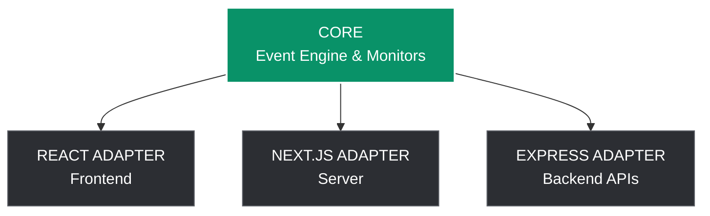

  <h1>Traceora Architecture & Internal Documentation</h1>
  
<strong>A deep dive into the architectural notes and specifications for the Traceora intelligence platform.</strong>

---

## 🏗️ Architecture Overview

Traceora follows a highly scalable, composable monorepo architecture. 

## 📦 Packages Breakdown

### 1. `@traceora/core`
The core package is completely framework agnostic and forms the backbone of Traceora.
- **`EventStore`**: In-memory ring buffer storage for keeping a history of events efficiently.
- **`EventEmitter`**: Standardized system to emit events with UUIDs and precise timestamps.
- **Interceptors**: Safely wraps native APIs like `window.fetch`, `window.onerror`, and `unhandledrejection`.

### 2. `@traceora/react`
The React adapter connects React's rendering lifecycle directly to the core event engine.
- Tracks `COMPONENT_MOUNT` and `COMPONENT_RENDER` events.
- Exposes `<TraceoraProvider>` to manage global telemetry context.
- Exposes `<TraceoraErrorBoundary>` to catch React-specific render crashes beautifully.
- Contains the sleek `TraceoraDevtools` floating UI overlay.

### 3. `@traceora/vite-plugin`
The Developer Experience (DX) powerhouse.
- Analyzes the Abstract Syntax Tree (AST) during the build process.
- Auto-injects `@traceora/react` hooks into all functional components.
- Achieves "Zero-Config" automatic tracking so you don't have to rewrite your app.

---

## 🗺️ Roadmap

- 🟢 **Phase 1:** Core Engine & Memory Store *(Completed)*
- 🟢 **Phase 2:** React Bindings *(Completed)*
- 🟢 **Phase 3:** Auto-Tracking (Vite Plugin) *(Completed)*
- 🟢 **Phase 4:** Network & Error Intelligence *(Completed)*
- 🟡 **Phase 5:** Next.js SSR & Server Components *(In Progress)*
- ⚪ **Phase 6:** Express / Node.js Backend Tracing *(Planned)*
- ⚪ **Phase 7:** Standalone CLI Dashboard *(Planned)*

---

  
<strong>Built by Zuhaib Rashid</strong>

  <a href="https://zuhaibrashid.com">🌍 Portfolio</a> &nbsp; | &nbsp; 
  <a href="https://github.com/zuhaib-dev">🐙 GitHub</a>

